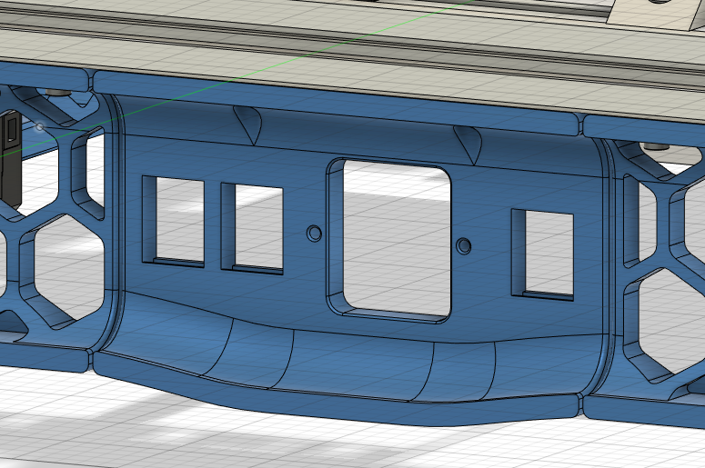

Adding a unnecessary amount of Keystone Holders to the Plug_Panel component, after moving the switch to the right skirt with @tayto-chip´s "skirt_switch_mod".

tayto-chip´s "skirt_switch_mod":
https://github.com/VoronDesign/VoronUsers/tree/master/printer_mods/tayto-chip/skirt_switch_mod
